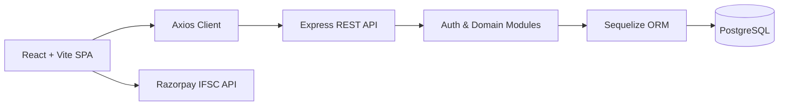

# LedgerFlow

**A double-entry accounting system made for managing core financial operations.**


---

## Overview

LedgerFlow is a full-stack accounting platform built for structured financial workflows across multiple tenants. It covers customers, vendors, invoices, bills, payments, bank accounts, organizations, chart-of-accounts, users, and journal transactions — all scoped by `organization_id` for clean data separation.

Key design principles include **balanced double-entry journal posting**, **dynamic bank balance management** tied directly to payment flows, **PIN-gated balance visibility** for bank accounts, and **IFSC-based bank detail lookup** to streamline account onboarding.

---

## Features

- **Multi-tenancy** — Workspace isolation through organizations with tenant-scoped records via `organization_id`
- **JWT Authentication** — Sign-up, sign-in, token verification, and protected frontend routes
- **Double-Entry Accounting** — Account creation, journal transactions, ledger entries, and debit-credit balance validation
- **Customer & Vendor Management** — Auto-generated reference numbers (`CUST-####`, `VEND-####`) with full CRUD
- **Invoices & Bills** — Auto-generated document numbers, due dates, tax fields, notes, and status tracking
- **Payment Workflows** — Payments received and payments made with partial settlement support and document status updates
- **Bank Account Management** — IFSC lookup via Razorpay's public API, masked account numbers, hashed 5-digit security PINs, and PIN-verified balance reveal
- **Live Balance Updates** — Bank balances update automatically when payments are recorded or reversed
- **Session Persistence** — `AuthContext`, Axios interceptors, and automatic bearer token attachment with `401`-triggered session clear

---

## Tech Stack

| Layer | Technologies |
|---|---|
| **Frontend** | React 19, TypeScript, Vite, React Router DOM 7, Axios |
| **Backend** | Node.js, Express 5, Sequelize 6, dotenv, bcryptjs, jsonwebtoken |
| **Database** | PostgreSQL, Sequelize models, Sequelize CLI migrations |
| **Auth & Security** | JWT bearer tokens, bcrypt password hashing, hashed bank PINs, CORS allowlist |
| **Integrations** | Razorpay public IFSC API |
| **Deployment** | Vercel (frontend), cloud-ready Express binding (backend) |

---

## Architecture



- The frontend uses `AuthProvider`, `ProtectedRoute`, and Axios interceptors to manage session state and attach bearer tokens
- The backend exposes grouped route modules for auth, organizations, users, accounts, transactions, and all finance operations
- Journal data flows through `transactions` and `ledger_entries`; finance documents flow through customers, vendors, invoices, bills, payments, and bank accounts
- Bank balances are updated inside payment workflows — not through the generic journal transaction module
- Tenant scoping is enforced via `organization_id` on domain records

---

## Project Structure

```
LedgerFlow/
├── backend/
│   ├── config/
│   ├── migrations/
│   ├── models/
│   └── src/
│       ├── app.js
│       ├── server.js
│       ├── db/
│       ├── middleware/
│       │   └── authMiddleware.js
│       ├── models/
│       │   ├── account.model.js
│       │   ├── bankAccount.model.js
│       │   ├── bill.model.js
│       │   ├── customer.model.js
│       │   ├── invoice.model.js
│       │   ├── ledgerEntry.model.js
│       │   ├── organization.model.js
│       │   ├── paymentMade.model.js
│       │   ├── paymentReceived.model.js
│       │   ├── transaction.model.js
│       │   ├── user.model.js
│       │   └── vendor.model.js
│       └── modules/
│           ├── account/
│           ├── auth/
│           ├── finance/
│           ├── organization/
│           ├── transaction/
│           └── user/
└── frontend/
    └── src/
        ├── api/
        ├── components/
        │   └── ProtectedRoute.tsx
        ├── contexts/
        │   └── AuthContext.tsx
        └── pages/
            ├── Accounts.tsx
            ├── BankAccounts.tsx
            ├── Bills.tsx
            ├── Customers.tsx
            ├── Home.tsx
            ├── Invoices.tsx
            ├── Organizations.tsx
            ├── PaymentsMade.tsx
            ├── PaymentsReceived.tsx
            ├── SignIn.tsx
            ├── SignUp.tsx
            ├── Transactions.tsx
            ├── Users.tsx
            └── Vendors.tsx
```

---

## Getting Started

### Prerequisites

- Node.js and npm
- PostgreSQL

### 1. Clone the repository

```bash
git clone <repository-url>
cd LedgerFlow
```

### 2. Install dependencies

```bash
# Backend
cd backend && npm install

# Frontend
cd ../frontend && npm install
```

### 3. Configure environment variables

Copy the example files and fill in your values:

```bash
cp backend/.env.example backend/.env
cp frontend/.env.example frontend/.env
```

See the [Environment Variables](#environment-variables) section for all required fields.

### 4. Run database migrations

```bash
cd backend
npx sequelize-cli db:migrate --config config/config.js
```

> **Note:** `config/config.js` reads from `DATABASE_URL`. If you use local `DB_*` variables at runtime, also define `DATABASE_URL` when running migrations.

### 5. Start the backend

```bash
# Development
cd backend && npm run dev

# Production (runs migrations, then starts server)
cd backend && npm start
```

### 6. Start the frontend

```bash
cd frontend && npm run dev
```

The frontend runs at `http://localhost:5173` by default. The backend defaults to `http://localhost:5000`.

---

## Environment Variables

### Backend — `backend/.env`

| Variable | Required | Description |
|---|---|---|
| `DATABASE_URL` | Recommended | PostgreSQL connection string for Sequelize CLI and runtime |
| `DB_HOST` | Optional | Local PostgreSQL host (fallback when `DATABASE_URL` is not set) |
| `DB_PORT` | Optional | Local PostgreSQL port — defaults to `5432` |
| `DB_NAME` | Optional | Local PostgreSQL database name |
| `DB_USER` | Optional | Local PostgreSQL user |
| `DB_PASS` | Optional | Local PostgreSQL password |
| `JWT_SECRET` | **Yes** | Secret for signing and verifying JWT tokens |
| `NODE_ENV` | Optional | `development` or `production` |
| `FRONTEND_URL` | Recommended | Allowed CORS origin(s) — comma-separated for multiple |
| `PORT` | Optional | API server port — defaults to `5000` |

### Frontend — `frontend/.env`

| Variable | Required | Description |
|---|---|---|
| `VITE_API_URL` | **Yes** | Base API URL for Axios — e.g. `http://localhost:5000/api` |

---

## API Reference

### Health & Auth

| Method | Endpoint | Description |
|---|---|---|
| `GET` | `/` | Root API status |
| `GET` | `/api/health` | Health check |
| `POST` | `/api/auth/signup` | Register a user, create an organization, return JWT |
| `POST` | `/api/auth/signin` | Authenticate a user, return JWT |
| `GET` | `/api/auth/verify` | Verify a bearer token |

### Organizations, Users, Accounts & Transactions

| Method | Endpoint | Description |
|---|---|---|
| `GET` | `/api/organizations` | List organizations for the authenticated user |
| `POST` | `/api/organizations` | Create a new organization |
| `GET` | `/api/users` | List users, optionally filtered by `organization_id` |
| `POST` | `/api/users` | Create a user record for an organization |
| `GET` | `/api/accounts` | List chart-of-accounts entries |
| `POST` | `/api/accounts` | Create a chart-of-accounts entry |
| `GET` | `/api/transactions` | List transactions with nested ledger entries |
| `POST` | `/api/transactions` | Post a balanced journal transaction |

### Finance

| Method | Endpoint | Description |
|---|---|---|
| `GET / POST` | `/api/finance/customers` | List or create customers |
| `PUT / DELETE` | `/api/finance/customers/:id` | Update or delete a customer |
| `GET / POST` | `/api/finance/vendors` | List or create vendors |
| `PUT / DELETE` | `/api/finance/vendors/:id` | Update or delete a vendor |
| `GET / POST` | `/api/finance/invoices` | List or create invoices |
| `PUT / DELETE` | `/api/finance/invoices/:id` | Update or delete an invoice |
| `GET / POST` | `/api/finance/bills` | List or create bills |
| `PUT / DELETE` | `/api/finance/bills/:id` | Update or delete a bill |
| `GET / POST` | `/api/finance/payments-received` | List or record incoming payments |
| `PUT / DELETE` | `/api/finance/payments-received/:id` | Update or reverse a payment received |
| `GET / POST` | `/api/finance/payments-made` | List or record outgoing payments |
| `PUT / DELETE` | `/api/finance/payments-made/:id` | Update or reverse a payment made |
| `GET / POST` | `/api/finance/bank-accounts` | List or create bank accounts |
| `GET / PUT / DELETE` | `/api/finance/bank-accounts/:id` | Fetch, update, or delete a bank account |
| `POST` | `/api/finance/bank-accounts/:id/verify-pin` | Verify PIN and return current balance |

---

## Core Modules

| Module | Summary |
|---|---|
| **Customers** | Tenant-scoped records with contact, address, tax, and payment term fields |
| **Vendors** | Same structure as customers — master data for payables workflows |
| **Invoices** | Linked to customers with auto-numbers, totals, due dates, and payment-driven status |
| **Bills** | Linked to vendors with the same document structure as invoices |
| **Payments** | Inflow and outflow recording against invoices/bills with bank balance updates and partial settlement |
| **Bank Accounts** | IFSC-enriched metadata, hashed PINs, hidden balances, and PIN-verified balance reveal |
| **Multi-Tenancy** | Organizations as tenant boundaries; `organization_id` scopes all finance and accounting entities |
| **Double-Entry Accounting** | Enforced balancing — every posted transaction must have at least two entries with equal debits and credits |

---

## Security

- **Passwords** hashed with `bcryptjs` before storage
- **Bank PINs** hashed before storage — never returned in list or detail reads
- **Balances** hidden by default — revealed only through the dedicated `verify-pin` endpoint
- **JWT** stored in `localStorage`; Axios auto-attaches the bearer token and clears the session on `401`
- **CORS** controlled via `FRONTEND_URL` with comma-separated multi-origin support
- **Outgoing payments** validate available bank balance before debiting
- **Journal transactions** rejected unless total debits equal total credits

---

## Deployment

### Frontend (Vercel)

- Build command: `npm run build`
- Output directory: `dist`
- SPA rewrites are pre-configured in `frontend/vercel.json`
- Set `VITE_API_URL` to the deployed backend API base URL

### Backend

- Set the deployment root to `backend/`
- Install: `npm install`
- Start: `npm start` — runs migrations before starting the server
- Required environment variables: `DATABASE_URL`, `JWT_SECRET`, `FRONTEND_URL`, `NODE_ENV=production`
- Binds to `0.0.0.0` for cloud compatibility

### Database

- Provision a PostgreSQL instance
- Set `DATABASE_URL` to a valid connection string
- SSL is enabled in the Sequelize config for managed PostgreSQL environments

---

## Usage Guide

1. **Sign up** to create a user account and an initial organization from `company_name`
2. **Sign in** and select an organization from the dashboard
3. **Create accounts** in the Accounts module — assets, liabilities, income, expenses, equity
4. **Post transactions** in the Transactions module with at least two balanced ledger entries
5. **Add customers and vendors**, then create invoices and bills linked to them
6. **Set up bank accounts** — fetch details via IFSC and set a 5-digit security PIN
7. **Record payments** to update settlement status and bank balances automatically
8. **Verify PIN** on the Bank Accounts page to reveal the current stored balance

---

## Roadmap

- [ ] Route-level authentication and authorization across the full API surface
- [ ] Automated backend tests and end-to-end tests for accounting workflows
- [ ] Role-based access control for multi-user organizations
- [ ] Auto-posting of finance documents into the accounting ledger
- [ ] Reporting modules — trial balance, receivables/payables aging, cash flow
- [ ] Audit logs, reconciliation workflows, exports, and file attachments
- [ ] PIN rotation and recovery flows for bank accounts

---

## Contributing

1. Fork the repository and create a feature branch
2. Install dependencies in both `backend/` and `frontend/`
3. Keep schema changes in `backend/migrations/` in sync with model updates
4. Run `npm run lint` and `npm run build` inside `frontend/` before opening a PR
5. Verify backend migrations and startup locally before submitting
6. Open a pull request with a clear description of the problem, solution, and affected modules

> There is currently no automated backend test script — backend verification is manual.

---

## License

This project is licensed under the **MIT License**. See the [LICENSE](LICENSE) file for details.

---

*Built by **Bhuvan Golhar***
LinkedIn: https://linkedin.com/in/bhuvangolhar
Portfolio: https://bhuvangolhar.space